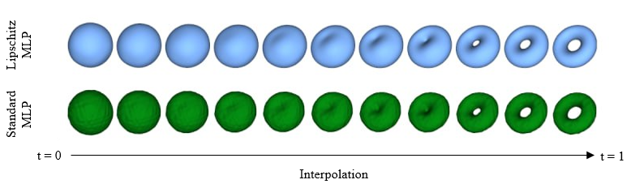

# Implicit Interpolation with Lipschitz Regularization
Shape interpolation is a critical task in computer graphics and 3D modeling, and this project explores the use of a neural implicit field, a deep learning model, for this purpose. This project present a method to improve implicit shape interpolation by applying Lipschitz regularization to the neural implicit field. The use of Lipschitz regularization results in the smoothing of the neural implicit field of the neural network, consequently enabling more meaningful and visually coherent interpolations between latent codes.

This is an implementation of the paper [Learning Smooth Neural Functions via Lipschitz Regularization](https://research.nvidia.com/labs/toronto-ai/lip-mlp/lipmlp_final.pdf)

The model weights and the interpolation between a Sphere and Torus is available [here](https://drive.google.com/drive/folders/1Cr3JA6I8CvJZzK3ivughkSfly9NajQUO?usp=sharing). Additional studies on the performance of this technique using more complex shapes (e.g. humans) reveal the possibility of oversmoothing, where the model fails to learn the correct reconstruction of the shape.
